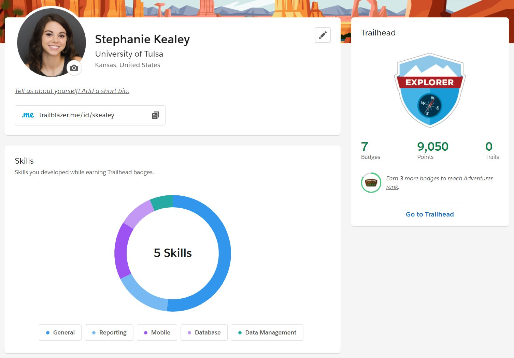

# Stephanie Kealey's Resume

My name is Stephanie Kealey and I am a senior Computer Information Systems major with a minor in Spanish. I will use this repository to display the skills and certifications I acquired in my time at The University of Tulsa.

<h2>Technical Skills</h2>

GitHub

  <h3> Description: </h3>
I completed the introductory GitHub learning labs offered on the <a href="https://lab.github.com/courses">GitHub website.</a> The training  provided in-depth learning about the GitHub workflow as well as an overview of fundamental GitHub skills.
   
  <h4>Skills:</h4>
  <ul>
<li>Introduction to GitHub</li>
<li>Communicating using Markdown</li>
<li>Uploading your project to GitHub</li>
<li>GitHub pages</li>
<li>Reviewing pull requests</li>
<li>Managing merge conflicts</li>
<li>Securing your workflows</li>
</ul>

<h3> Course Completion: </h3>

 

PowerBI

  <h3> Description: </h3>
I completed an <a href="https://powerbi.microsoft.com/en-us/learning/">online training course</a> offered by EdX.
 
 
  The 9 Power BI learning modules and corresponding labs include an overview of fundamental data analysis and visualization skills using Power BI.
   
  <h4>Skills:</h4>
<ul>
<li>Manipulating data in the Power BI desktop, indcluding spreadsheets and parameters</li>
<li>Modeling data thorugh creating columns and tables</li>
<li>Analyzing and visualizing data thorugh graphs, slicers, and conditional formatting</li>
<li>Creating and editing dashboards in Power BI Service</li>
<li>Appropriately formatting Excel to use compatibly with Power BI</li>
<li>Managing and updating both data content and security</li>
<li>Creating live connections to servers (through SQL Azure, SQL Database, etc.)</li>
<li>Developer API</li>
<li>Power BI mobile phone/tablet compatibility and features</li>
</ul>
  <h3>Course Completion: </h3>
  View an in-depth explaination of my <a href="https://youtu.be/J8JPkh9XevI">Retail Analysis Dashboard</a> created with sample data from Microsoft.
  

Linux

  <h3> Description: </h3>
  I completed the LPI Linux Essentials course on <a href="https://linuxacademy.com/">Linux Academy</a>. These courses gave me an introduction to the Linux operating system and the Linux kernel, as well as the Linux command line syntax.
  
<h4>Skills:</h4>
<ul>
<li>Linux Evolution and Popular Operating Systems</li>
<li>Major Open Source Applications</li>  
<li>ICT Skills and Working in Linux</li>
<li>Using Directories and Listing Files</li> 
<li>The Linux Operating System</li>
<li>Security and File Permissions</li>
<li>Basic Security and Identifying User Groups</li>
<li>Managing File Permissions and Ownership</li> 
<li>Special Directories and Files</li> 
</ul>
   
  With the completion of the Linux Essentials course, I was able to install Virtual Box and Ubuntu from this <a href="https://sal-a.github.io/vbox-ubuntu/#2-download-an-iso-file-for-ubuntu-from-httpsubuntucomdownloaddesktop">installation guide</a> to deploy an Algo VPN IPSec server installation and operational test with these <a href="https://github.com/trailofbits/algo">setup instructions</a> that utilized Digital Ocean. The subsequent screenshot helps showcase the successful host IP address, AlgoVPN IP address, and DigitalOcean droplet:
 
 

AWS

  <h3> Description: </h3>
  Through completing the <a href="https://linuxacademy.com/cp/modules/view/id/241?redirect_uri=https://app.linuxacademy.com/search?query=w&categories=AWS&type=Course">Amazon Web Services Essentials</a> course on Linux Academy, I was introduced to the core of AWS services and have applied the following concepts to real-world applications. Additonally, I learned how to setup my personal AWS account and how AWS uses its platform to manage databases, storage services, and elastic cloud computations.
   
  <h4>Skills:</h4>
  <ul>
<li>Managing AWS Access with Users, Groups, and Roles</li>
<li>Networking Services and Connectivity</li>  
<li>Compute Services</li>
<li>Storage Services</li> 
<li>Database Services</li>
<li>Monitoring, Alerts, and Notifications</li>
<li>Load Balancing, Elasticity, and Scalability</li>
<li>Serverless Compute</li>  
</ul>
   
After completing the AWS Essentials course, I configured an additonal Virtual Private Network with an OpenVPN Access Server that would be on AWS. I followed this <a href="https://openvpn.net/vpn-server-resources/amazon-web-services-ec2-byol-appliance-quick-start-guide/">installation guide</a> which included the launch and configuration steps to deploy the OpenVPN Access Server on EC2 within AWS. The following screenshot helps showcase my accomplished OpenVPN Access Server launch with my current EC2 instance and Active Configuration:
 
 

PowerShell

  <h3> Description: </h3>
 With the completion of the PowerShell 5 Essential Training provided by <a href="https://www.linkedin.com/learning/powershell-5-essential-training/welcome">LinkedIn,</a> I was introduced to the basics of PowerShell 5 and the capabilities you can access and work within the Windows operating system. For example, I was able to learn and grasp the automation security, scripting, and integrated scripting environment (ISE) topics for a better understanding of scripting and automation in Windows PowerShell. This course also included content about understanding how to utilize cmdlets with administator access and the useful assistance of help commands for syntax, csv and xml file exports and imports, and script writing in the ISE.
  
  <h4>Skills:</h4>
  <ul>
<li>Getting Ready for PowerShell</li>
<li>Discovery and Getting Help</li>  
<li>Extending Your Capabilities with PowerShell</li>
<li>Using the Power of the Pipeline</li> 
<li>Database Services</li>
<li>Getting More out of Objects</li>
<li>Scripts and Automation</li>
<li>Scalable Management with PowerShell Remoting</li>  
</ul>
  
 <h4> PowerShell 5 Essential Course Completion Certificate: </h4>

SalesForce

  <h3> Description: </h3>
  
 With the completion of the Salesforce Admin Beginner Course provided by <a href="https://trailhead.salesforce.com/en/content/learn/trails/force_com_admin_beginner">Trailhead,</a> I was introduced to the basics and utilities in Salesforce. As I was progressing through this course, I learned how to create reports with filters, create objects, fields and relationships, export and import data from different sources, and the ability to provide and create unique visualizations that can be made for many key business aspects. Being exposed and introduced to these topics and steps helped me understand the capabilities cloud technology can have on businesses and indivduals too.
  
<h4>Skills:</h4>
  <ul>
<li>Salesforce Platform Basics</li>
<li>Data Modeling</li>  
<li>Data Management</li>
<li>Lightning Experience Customization</li> 
<li>Salesforce Mobile App Customization</li>
<li>User Engagement</li>
<li>Reports & Dashboards for Lightning Experience</li> 
</ul>

 <h4> Salesforce Admin Beginner Course Completion & Badges: </h4>

 
<h2>Certifications</h2>

Certificate

 <h3>LPI Linux Essentials Course Completion Certificate:</h3>

   
   <h3>AWS Essentials Course Completion Certificate:</h3>

