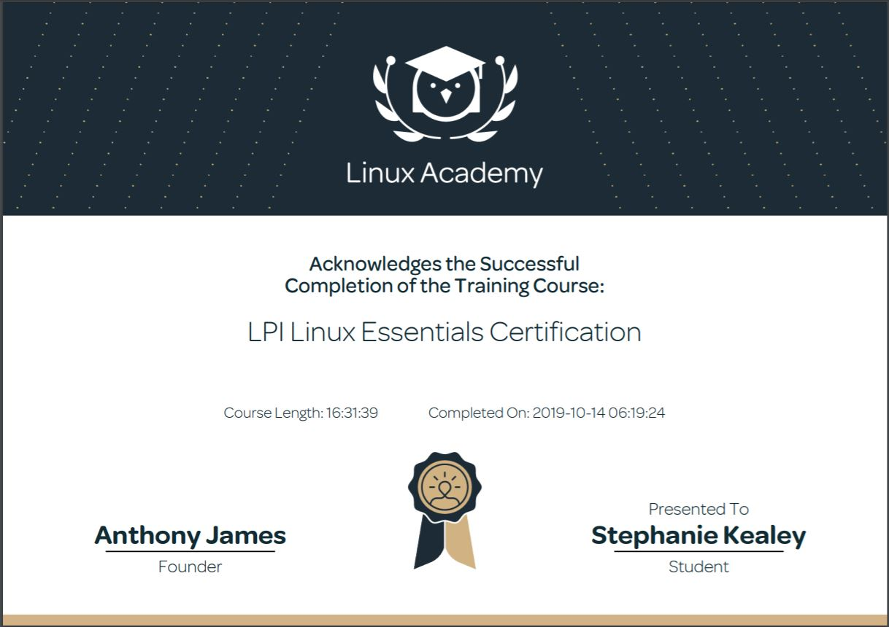

# Stephanie Kealey's Resume

My name is Stephanie Kealey and I am a senior Computer Information Systems major with a minor in Spanish. I will use this repository to display the skills and certifications I acquired in my time at The University of Tulsa.

<h2>Technical Skills</h2>

GitHub

  <h3> Description: </h3>
I completed the introductory GitHub learning labs offered on the <a href="https://lab.github.com/courses">GitHub website.</a> The training  provided in-depth learning about the GitHub workflow as well as an overview of fundamental GitHub skills.
   
  <h4>Skills:</h4>
  <ul>
<li>Introduction to GitHub</li>
<li>Communicating using Markdown</li>
<li>Uploading your project to GitHub</li>
<li>GitHub pages</li>
<li>Reviewing pull requests</li>
<li>Managing merge conflicts</li>
<li>Securing your workflows</li>
</ul>

<h3> Course Completion: </h3>

 

PowerBI

  <h3> Description: </h3>
I completed an <a href="https://powerbi.microsoft.com/en-us/learning/">online training course</a> offered by EdX.
 
 
  The 9 Power BI learning modules and corresponding labs include an overview of fundamental data analysis and visualization skills using Power BI.
   
  <h4>Skills:</h4>
<ul>
<li>Manipulating data in the Power BI desktop, indcluding spreadsheets and parameters</li>
<li>Modeling data thorugh creating columns and tables</li>
<li>Analyzing and visualizing data thorugh graphs, slicers, and conditional formatting</li>
<li>Creating and editing dashboards in Power BI Service</li>
<li>Appropriately formatting Excel to use compatibly with Power BI</li>
<li>Managing and updating both data content and security</li>
<li>Creating live connections to servers (through SQL Azure, SQL Database, etc.)</li>
<li>Developer API</li>
<li>Power BI mobile phone/tablet compatibility and features</li>
</ul>
  <h3>Course Completion: </h3>
  View an in-depth explaination of my <a href="https://youtu.be/J8JPkh9XevI">Retail Analysis Dashboard</a> created with sample data from Microsoft.
  

Linux

  <h3> Description: </h3>
  I completed the LPI Linux Essentials course on <a href="https://linuxacademy.com/">Linux Academy</a>. These courses gave me an introduction to the Linux operating system and the Linux kernel, as well as the Linux command line syntax.
  
<h4>Skills:</h4>
<ul>
<li>The Linux Community and a Career in Open Source</li>
<li>Linux Evolution and Popular Operating Systems</li>
<li>How to Access a Linux Installation</li>
<li>Major Open Source Applications</li>  
<li>Understanding Open Source Software and Licensing</li> 
<li>ICT Skills and Working in Linux</li>
<li>Command Line Basics</li> 
<li>Using Directories and Listing Files</li> 
<li>Archiving Files on the Command Line</li> 
<li>Searching and Extracting Data from Files</li> 
<li>Turning Commands into a Script</li>
<li>The Linux Operating System</li>
<li>Security and File Permissions</li>
<li>Basic Security and Identifying User Groups</li>
<li>Creating Users and Groups</li> 
<li>Managing File Permissions and Ownership</li> 
<li>Special Directories and Files</li> 
</ul>

AWS

  <h3> Description: </h3>
Currently working on and will update upon completion.

PowerShell

  <h3> Description: </h3>
Currently working on and will update upon completion.

SalesForce

  <h3> Description: </h3>
Currently working on and will update upon completion.

 
<h2>Certifications</h2>

Certificate

 <h3>LPI Linux Essentials Course Completion Certificate:</h3>

 

